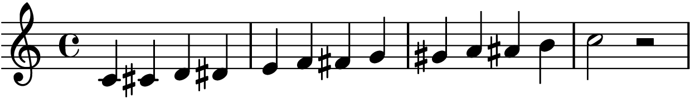

Chromatic-Solfege for Lilypond
===============================

This `chromatic-solfege.ly` allows you to write Lilypond scores with Chromatic-Solfege. 

### How to Install

Place the `chromatic-solfege.ly` to the include directory or the same directory
with your lilypond document.

### How to use

Include `chromatic-solfege.ly` then call the `language` directive with a
parameter 'chromatic-solfege'.

```lilypond
\version "2.18.2"
\include "chromatic-solfege.ly"
\language "chromatic-solfege"

\score {
  \relative do' {
    \clef treble
    \time 4/4
    \key do \major
    do 4 di re ri
    mi fa fi sol
    si la li ti
    do 2 r2
  } 
}
```

#### The Result



